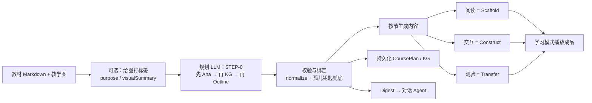

# Aha Keys + Knowledge Graph 工程师手册

> **读完这份就能在任意 learning-agent 管线里落地，不必翻源码。**
>
> 本文同时讲清楚两件事：
> 1. **Aha Keys（顿悟点）**——课必须装进学生脑子的 2–5 把“可迁移钥匙”
> 2. **Knowledge Graph（知识图谱 / 心智图）**——钥匙挂在哪些概念上、先学什么后学什么、每节课覆盖什么
>
> XR EduAgent 只是这套契约的一个参考实现；你可以用任何 LLM + 任何交互运行时复现。

---

## 0. 五分钟速览

| 问题 | 答案 |
|------|------|
| Aha Key 是什么？ | 一句学生能复述、换题面仍成立的洞见（不是知识点列表） |
| Knowledge Graph 是什么？ | 概念节点 + 先修边 + 贯穿主例 + 挂着的 ahaKeys |
| 谁先谁后？ | **先蒸馏 aha → 再铺节点/边 → 再排课节并指定谁安装哪把钥匙** |
| 谁“安装”钥匙？ | 优先交互节（H5 / 3D / 仿真）；阅读铺垫；测验验证迁移 |
| 学生学习时要不要读 aha API？ | **不必**。把钥匙写进生成内容即可；本设计没有学生侧 mastery runtime |
| 最小可交付物？ | 一份 JSON：`{ ahaKeys, nodes, edges, chapters }`，再按节生成内容 |

**三条教学动作（整份手册都围着它转）：**

| 阶段 | 英文 | 典型模态 | 目标 |
|------|------|----------|------|
| 铺垫 | Scaffold | 阅读 / 讲解 | 点出误解 → 铺到 insight |
| 建构 | Construct | 交互 / 仿真 / 3D | 学生动手后自己“长出”insight |
| 迁移 | Transfer | 测验 / 换皮题 | 换故事外壳，仍能做对 |

---

## 1. 完整数据契约（可直接当 API Schema）

### 1.1 AhaKey

```ts
type AhaKey = {
  id: string;              // 如 "aha1"；课程内唯一
  insight: string;         // 必填。学生语言的一句洞见；空串应丢弃整条
  whyKey?: string;         // 为什么拥有它就能解任何换皮题
  misconception?: string;  // 它要打掉的常见错误直觉
  buildIdea?: string;      // 可操作体验蓝本：predict → act → observe → articulate
  nodeIds?: string[];      // 关联的图谱节点 id
};
```

**质量标准（写 prompt / 做人工验收都用这条）：**

- `insight`：短、可复述、可迁移；禁止只复述教材定义句。
- `misconception`：真实学生错觉，不是“不知道”。
- `buildIdea`：必须能让人“动手”；禁止“显示一句结论让学生读”。
- 数量：**2–5 条/课**。少于 2 通常太碎或太浅；多于 5 通常在背事实。

**好 vs 坏：**

| | 坏（事实/定义） | 好（可迁移钥匙） |
|--|----------------|------------------|
| 物理 | “抛体运动轨迹是抛物线” | “任意运动可分解成彼此完全独立的分量运动；曲线只是它们的合成” |
| 化学 | “CO₂ 是直线形分子” | “数的是电子域，不是键线条数；双键/三键各只算 1 个域” |
| 机械 | “齿轮传动比 = 齿数比” | “接触点线速度相同 → 角速度与半径成反比；转向必然相反” |

---

### 1.2 Knowledge Graph（KnowledgeGraph）

Aha **不是**孤立字段，它挂在课程级图谱上：

```ts
type KnowledgeGraph = {
  version: number;                    // 建议固定 1
  level?: 'elementary' | 'middle' | 'high';
  courseTitle?: string;
  courseGoal?: string;                // 学完后学生能做什么
  anchorExample?: string;             // 贯穿全课的一个主例（同一故事串起来）
  nodes: KGNode[];
  edges: KGEdge[];
  ahaKeys: AhaKey[];                  // ★ 课程级顿悟点
  sourceFilename?: string;            // 来源材料名（防串课）
  updatedAt?: number;
};

type KGNode = {
  id: string;                         // 如 "n1"；课程内唯一
  kind: NodeKind;
  label: string;                      // 显示名 / 概念名
  mastery?: string;                   // 学完后学生必须能答对什么（验收句）
  notes?: string;                     // 可选备注
  coverage?: string;                  // 可选：planned | taught | …
  fromFigure?: string;                // 可选：从哪张教学图抽出
};

type NodeKind =
  | 'concept'      // 核心概念
  | 'subconcept'   // 子概念
  | 'principle'    // 原理 / 定律级洞见载体
  | 'skill'        // 可操作技能（画图、分解、计算步骤）
  | 'equation'     // 公式
  | 'perk'         // 必会“得分点”（考试/任务硬要求）
  | 'example';     // 例题 / 主例节点

type KGEdge = {
  from: string;                       // 先修节点 id
  to: string;                         // 后继节点 id
  relation?: string;                  // 默认 "prerequisite"；也可 "part-of" / "applies-to" 等
};
```

**图谱在管线里的职责：**

| 字段 | 干什么用 |
|------|----------|
| `nodes` | 课要教会的全部硬点；节的 `covers[]` 只能引用这里的 id |
| `edges` | 学习顺序约束（先学 from，再学 to） |
| `anchorExample` | 全课共用一个主例，避免每节换故事导致碎片化 |
| `ahaKeys` | 教学真正对准的目标；内容生成盯 insight，不只盯 label |
| `courseGoal` / `level` | 控制深度与措辞 |

**Aha ↔ Node 关系（务必理解）：**

- Node = “要会的东西”（概念/技能/公式）
- Aha = “打通这些东西的那把钥匙”
- 一个 aha 通常挂 1–N 个 `nodeIds`
- 一个 node 可被多个 aha 引用，也可不被任何 aha 引用（纯工具性先修）

---

### 1.3 Learning Outline（课节如何挂接图谱与钥匙）

```ts
type Section = {
  id?: string;
  title: string;
  type: 'reading' | 'h5' | 'quiz' | 'vr' | string; // 外系统可换成 video/sim/lab…
  purpose?: string;
  role?: 'opening' | 'development' | 'application' | 'consolidation';
  covers: string[];          // 本节覆盖的 node id
  installsAha: string[];     // 本节负责安装或验证的 aha id
  sourceHint?: string;       // 对应教材哪一段 / 哪张图
  figureIds?: string[];      // 绑定的教学图 id
};

type Chapter = {
  title: string;
  summary?: string;
  sections: Section[];
};

type CoursePlan = {
  courseTitle: string;
  courseGoal: string;
  level: 'elementary' | 'middle' | 'high';
  anchorExample: string;
  ahaKeys: AhaKey[];
  nodes: KGNode[];
  edges: KGEdge[];
  chapters: Chapter[];
};
```

**安装规则（硬约束）：**

1. 每个 `ahaKey.id` 必须出现在 **≥1** 个 section 的 `installsAha` 里。
2. **主安装器**优先交互节（H5 / 3D / 仿真）；阅读只做铺垫；测验的 `installsAha` 表示“验证这把钥匙”。
3. `covers[]` 里的每个 id 必须存在于 `nodes[]`。
4. `installsAha[]` 里的每个 id 必须存在于 `ahaKeys[]`。
5. 大纲行走顺序应大体尊重 `edges`（先修在前）。

**孤儿钥匙兜底（规划模型漏写时）：**

```
for each aha not in any installsAha:
  prefer section where type in {vr,h5,sim} AND covers ∩ aha.nodeIds ≠ ∅
  else any interactive section
  else any reading
  else first section
  → push aha.id into that section.installsAha
```

---

### 1.4 分节上下文（生成内容时喂给下游的小包）

生成某一节内容前，组装：

```ts
type SectionContext = {
  section: Pick<Section, 'id' | 'title' | 'type' | 'purpose' | 'covers' | 'installsAha' | 'sourceHint'>;
  coveredNodes: KGNode[];          // covers 解析后的节点（含 mastery）
  ahaKeys: Array<AhaKey & {
    mustInstall: boolean;          // true = 本节 installsAha 显式包含
  }>;
  kgDigest: string;                // 见 §1.5，压缩摘要
  images?: FigureMeta[];            // 可选教学图
  peerBoard?: string[];            // 可选：其他节已讲过的要点，防重复
};
```

**aha 选取规则：**

1. `installsAha` 命中的；或
2. 该 aha 的 `nodeIds` 与本节 `covers` 有交集；
3. 建议最多 4 条，避免一节塞太多洞见。

---

### 1.5 Digest（给对话 Agent / 调试用的纯文本摘要）

把图谱压成短文本，注入后续 LLM 轮次：

```text
[Knowledge Graph / MindMap]
level: middle
course: Projectile Motion Essentials
goal: Decompose any launch into independent axes and recombine.
anchorExample: Super Dave cannon shot into a net 40 m away at 45°
nodes (N):
- n1 [concept] Projectile — mastery: Define projectile and name the only force after release
- n2 [principle] Independent x/y motion — mastery: Explain why horizontal velocity stays constant
...
edges (M):
- n3 -[prerequisite]-> n2
- n2 -[prerequisite]-> n5
ahaKeys — the transferable insights this course must install (teach toward these, not just facts):
- aha1: Motion decomposes into fully independent components (defeats: Gravity somehow pushes sideways)
- aha2: The curve is just recombination of those components (defeats: Curves need a special curved force)
Rule: later teaching / quizzes MUST cover these nodes; never use a concept that was never taught (follow edges).
```

---

## 2. 端到端管线（与实现无关的节点图）



| 阶段 | 输入 | 输出 | 是否创造 Aha |
|------|------|------|----------------|
| 图标签（可选） | 原图 | `visualSummary` 等 | 否 |
| 规划 | 全文 + 图摘要 | `CoursePlan`（含 ahaKeys） | **是（唯一创造点）** |
| 校验绑定 | Plan | 干净的 KG + Outline | 否（可补 installsAha） |
| 分节生成 | SectionContext | 阅读/交互/测验内容 | 否（只消费） |
| 学习播放 | 成品内容 | 学生体验 | 否 |

**创造只发生一次。** 后面全是消费与展示。

---

## 3. 规划 Prompt（可直接复制）

把下面当作 `system`；`user` 里只放**当前这份**教材（务必带材料 id / 文件名，防串课）。

```text
You are a MASTER teacher and instructional designer.
From teaching material, FIRST distill the "aha keys",
THEN build a Knowledge Graph (mind map),
THEN a Learning Outline that walks that graph and installs every aha key.
Reply with ONE JSON object only, matching the CoursePlan schema.

STEP 0 — AHA KEYS (think this BEFORE anything else):
Ask: "If students solve ANY re-skinned problem of this type for full marks,
what 2–5 deep insights must they GET?" These are transferable keys, not facts.

Worked shape example (ONLY a shape example — invent this topic ONLY if the source is about it):
Projectile motion aha keys look like:
 ① Motion decomposes into fully independent component motions (e.g. x & y).
 ② The curved path is just those components recombined — not a mysterious curved force.
 ③ Single-axis a–v–x–t relations must be solid first, or even one axis stays confusing.

Rules:
- ahaKeys: 2–5. insight = short & repeatable in student language.
  buildIdea = student MANIPULATES something and the insight emerges
  (predict → act → observe → articulate), never "read a statement of it".
- AHA INSTALL RULE: every ahaKey MUST appear in installsAha[] of ≥1 section.
  PRIMARY installer should be an interactive section (h5/vr/sim).
  reading may prepare/reinforce; quiz lists ahas it verifies.
- nodes = all must-master perks. Include prerequisites an aha depends on
  even if the source treats them as assumed.
- FIGURE GROUNDING: if pedagogical figures are provided, extract nodes from
  their visualSummary — dense tables/diagrams often hold the real syllabus.
- edges = learning order (prerequisite: must learn "from" before "to").
- Outline MUST walk the graph in a teachable order.
- Every covers[] id ∈ nodes[]; every installsAha[] id ∈ ahaKeys[].
- Prefer 4–10 sections for a short handout.
```

**User 消息模板：**

```text
SOURCE LOCK:
jobId: <unique-id>
filename: <material-name>
Build EXCLUSIVELY from THIS document. Do NOT reuse aha keys / nodes / outline
ideas from any prior material or chat.

Pedagogical figures (optional JSON):
<figures>

Markdown:
<source markdown>
```

---

## 4. 多组完整例子（Aha + Knowledge Graph 一起看）

> 下列 JSON 是**教学契约示例**，足够让工程师看懂字段怎么填；不必与仓库内某次运行结果逐字相同。

---

### 例子 A — 抛体运动（经典三项钥匙）

**教材主题：** 平抛 / 斜抛入门讲义  
**anchorExample：** “超人戴夫以 45° 射出，落点网距 40 m，求炮口速率”

```json
{
  "courseTitle": "Projectile Motion Essentials",
  "courseGoal": "Decompose any launch into independent axes, recombine, and solve range problems.",
  "level": "middle",
  "anchorExample": "Super Dave shot from a cannon at 45° into a net 40 m away",
  "ahaKeys": [
    {
      "id": "aha1",
      "insight": "Any motion can be split into component motions that do not affect each other.",
      "whyKey": "Once axes are independent, every launch problem becomes two one-dimensional problems.",
      "misconception": "Something must keep pushing the object sideways while it flies.",
      "buildIdea": "Show an x-marker sliding at constant speed, a y-marker in free fall, and the combined ball; toggles isolate each component.",
      "nodeIds": ["n_proj", "n_indep", "n_force"]
    },
    {
      "id": "aha2",
      "insight": "The curved path is nothing extra — it is just the two independent motions drawn together.",
      "whyKey": "Students stop hunting for a 'curve force' and start recomposing vectors.",
      "misconception": "Curves require a special curved force or gravity turning sideways at the top.",
      "buildIdea": "Trace the combined parabola while the separate x/y markers stay visible beside it.",
      "nodeIds": ["n_indep", "n_recombine"]
    },
    {
      "id": "aha3",
      "insight": "You must own a–v–x–t on ONE axis before you glue two axes together.",
      "whyKey": "Decomposition fails if either axis's kinematics is mushy.",
      "misconception": "Jumping straight to 'the range formula' without single-axis fluency.",
      "buildIdea": "A single-axis sandbox: change a, read v(t) and x(t), before unlocking 2D mode.",
      "nodeIds": ["n_kinematics", "n_components"]
    }
  ],
  "nodes": [
    { "id": "n_proj", "kind": "concept", "label": "Projectile",
      "mastery": "Define a projectile and name the only force after release (idealized)." },
    { "id": "n_force", "kind": "principle", "label": "Gravity as sole force",
      "mastery": "State that after release, horizontal force is zero in the ideal model." },
    { "id": "n_kinematics", "kind": "skill", "label": "1D a–v–x–t",
      "mastery": "Given a and v0 on one axis, write v(t) and x(t)." },
    { "id": "n_indep", "kind": "principle", "label": "Independent x/y motion",
      "mastery": "Explain why vx stays constant while vy changes." },
    { "id": "n_components", "kind": "equation", "label": "v0x, v0y split",
      "mastery": "Write v0x=v0 cosθ and v0y=v0 sinθ and use them." },
    { "id": "n_recombine", "kind": "skill", "label": "Time as the bridge",
      "mastery": "Solve flight time from y, then feed the same t into x." },
    { "id": "n_cannon", "kind": "example", "label": "Cannon-to-net 40 m",
      "mastery": "Compute v0 for 45° and 40 m using the shared-time method." }
  ],
  "edges": [
    { "from": "n_kinematics", "to": "n_indep", "relation": "prerequisite" },
    { "from": "n_proj", "to": "n_force", "relation": "prerequisite" },
    { "from": "n_force", "to": "n_indep", "relation": "prerequisite" },
    { "from": "n_indep", "to": "n_components", "relation": "prerequisite" },
    { "from": "n_components", "to": "n_recombine", "relation": "prerequisite" },
    { "from": "n_recombine", "to": "n_cannon", "relation": "applies-to" }
  ],
  "chapters": [
    {
      "title": "From straight lines to curved flight",
      "sections": [
        {
          "title": "What counts as a projectile",
          "type": "reading",
          "role": "opening",
          "covers": ["n_proj", "n_force"],
          "installsAha": [],
          "sourceHint": "Definitions + misconception that gravity turns off at the top"
        },
        {
          "title": "Watch x and y ignore each other",
          "type": "vr",
          "role": "development",
          "covers": ["n_indep", "n_force"],
          "installsAha": ["aha1", "aha2"],
          "sourceHint": "Independence demo / rollerblader toss"
        },
        {
          "title": "One-axis fluency booth",
          "type": "h5",
          "role": "development",
          "covers": ["n_kinematics"],
          "installsAha": ["aha3"]
        }
      ]
    },
    {
      "title": "Solve the cannon",
      "sections": [
        {
          "title": "Split the launch arrow",
          "type": "h5",
          "role": "application",
          "covers": ["n_components"],
          "installsAha": []
        },
        {
          "title": "Time is the bridge",
          "type": "reading",
          "role": "application",
          "covers": ["n_recombine", "n_cannon"],
          "installsAha": []
        },
        {
          "title": "Transfer check",
          "type": "quiz",
          "role": "consolidation",
          "covers": ["n_indep", "n_recombine", "n_cannon"],
          "installsAha": ["aha1", "aha2", "aha3"]
        }
      ]
    }
  ]
}
```

**读图要点：**

- `aha1/aha2` 的主安装器是 **VR**（空间可开关分量）。
- `aha3` 的主安装器是 **H5**（一维沙盒）。
- Quiz 的 `installsAha` 三条都列上 = **验证**，不是第二次建构。
- `n_kinematics` 可能教材一带而过，但作为 aha3 的先修仍必须进 `nodes`。

---

### 例子 B — VSEPR / 分子几何（视觉表驱动节点）

**教材主题：** VSEPR 讲义（含几何总表）  
**anchorExample：** “把 CO₂ 从数价电子一路做到直线形、180°”

```json
{
  "courseTitle": "VSEPR: From Lewis Map to Shape",
  "courseGoal": "Predict electron-domain and molecular geometry from a Lewis structure.",
  "level": "high",
  "anchorExample": "CO₂ end-to-end: 16 valence e⁻ → O=C=O → 2 domains → linear 180°",
  "ahaKeys": [
    {
      "id": "aha_domain",
      "insight": "You count ELECTRON DOMAINS, not bond lines or atoms. A double/triple bond is still ONE domain.",
      "whyKey": "Every VSEPR shape decision starts with the steric number; miscounting domains breaks every later step.",
      "misconception": "A double bond counts as two things because it is drawn with two lines.",
      "buildIdea": "Interactive Lewis builder: toggling a lone pair / double bond updates a live 'domain counter' and the 3D arrangement.",
      "nodeIds": ["n_domain", "n_lewis", "n_steric"]
    },
    {
      "id": "aha_two_geom",
      "insight": "Electron-domain geometry and molecular geometry are two different answers to two different questions.",
      "whyKey": "Lone pairs still push, but molecular shape only names atom positions.",
      "misconception": "Water is 'tetrahedral' because it has four domains — confusing the two geometries.",
      "buildIdea": "Same central atom with domains shown as balloons; toggle 'hide lone pairs' to switch the molecular-geometry label.",
      "nodeIds": ["n_egeom", "n_mgeom", "n_lp"]
    }
  ],
  "nodes": [
    { "id": "n_valence", "kind": "skill", "label": "Valence electron count",
      "mastery": "Sum valence electrons for molecules and ions." },
    { "id": "n_lewis", "kind": "skill", "label": "Lewis structure",
      "mastery": "Build a valid Lewis map and use formal charge to choose among options." },
    { "id": "n_domain", "kind": "concept", "label": "Electron domain",
      "mastery": "Define a domain and count domains around a central atom." },
    { "id": "n_steric", "kind": "perk", "label": "Steric number",
      "mastery": "State steric number = bonding domains + lone pairs." },
    { "id": "n_egeom", "kind": "principle", "label": "Electron-domain geometry",
      "mastery": "Name the geometry of ALL domains (e.g. tetrahedral for 4)." },
    { "id": "n_mgeom", "kind": "principle", "label": "Molecular geometry",
      "mastery": "Name the geometry of ATOMS only (e.g. bent for H2O)." },
    { "id": "n_lp", "kind": "subconcept", "label": "Lone-pair compression",
      "mastery": "Explain why lone pairs squeeze bond angles." },
    { "id": "n_table", "kind": "perk", "label": "AXE geometry table",
      "mastery": "Look up AX2 / AX2E2 / AX4E2 etc. and give shape + angle.",
      "fromFigure": "fig_vsepr_table" },
    { "id": "n_co2", "kind": "example", "label": "CO₂ worked example",
      "mastery": "Execute the full pipeline for CO₂ to linear 180°." }
  ],
  "edges": [
    { "from": "n_valence", "to": "n_lewis", "relation": "prerequisite" },
    { "from": "n_lewis", "to": "n_domain", "relation": "prerequisite" },
    { "from": "n_domain", "to": "n_steric", "relation": "prerequisite" },
    { "from": "n_steric", "to": "n_egeom", "relation": "prerequisite" },
    { "from": "n_egeom", "to": "n_mgeom", "relation": "prerequisite" },
    { "from": "n_lp", "to": "n_mgeom", "relation": "prerequisite" },
    { "from": "n_table", "to": "n_mgeom", "relation": "applies-to" },
    { "from": "n_mgeom", "to": "n_co2", "relation": "applies-to" }
  ],
  "chapters": [
    {
      "title": "The language of VSEPR",
      "sections": [
        {
          "title": "Valence electrons & Lewis map",
          "type": "reading",
          "covers": ["n_valence", "n_lewis"],
          "installsAha": [],
          "role": "opening"
        },
        {
          "title": "Count domains, not lines",
          "type": "h5",
          "covers": ["n_domain", "n_steric"],
          "installsAha": ["aha_domain"],
          "role": "development"
        },
        {
          "title": "Two geometries, two questions",
          "type": "vr",
          "covers": ["n_egeom", "n_mgeom", "n_lp"],
          "installsAha": ["aha_two_geom"],
          "role": "development",
          "figureIds": ["fig_vsepr_table"]
        }
      ]
    },
    {
      "title": "CO₂ end to end",
      "sections": [
        {
          "title": "Worked CO₂ pipeline",
          "type": "reading",
          "covers": ["n_co2", "n_table"],
          "installsAha": [],
          "role": "application"
        },
        {
          "title": "Shape transfer quiz",
          "type": "quiz",
          "covers": ["n_domain", "n_mgeom", "n_co2"],
          "installsAha": ["aha_domain", "aha_two_geom"],
          "role": "consolidation"
        }
      ]
    }
  ]
}
```

**读图要点：**

- `n_table` 带 `fromFigure`：总表图往往比正文更密，规划时必须从 `visualSummary` 抽节点。
- 两把钥匙分别用 **H5（计数）** 与 **VR（空间形状）** 安装——模态跟着 `buildIdea` 走。

---

### 例子 C — 齿轮传动（工程技能型）

```json
{
  "courseTitle": "Gear Trains: Speed, Torque, Direction",
  "courseGoal": "Predict ratio, direction, and torque tradeoff in a simple gear train.",
  "level": "middle",
  "anchorExample": "Hand crank → two spur gears → output shaft lifting a small weight",
  "ahaKeys": [
    {
      "id": "aha_pitch",
      "insight": "At the contact point the two gears share the SAME linear speed; that single fact gives ω ∝ 1/r.",
      "whyKey": "Every ratio formula is just 'shared tangential speed' in disguise.",
      "misconception": "The bigger gear always turns faster because it looks stronger.",
      "buildIdea": "Two meshed gears with a glowing contact-point marker; student sets teeth counts and watches ω1/ω2 update live.",
      "nodeIds": ["n_mesh", "n_ratio"]
    },
    {
      "id": "aha_dir",
      "insight": "External meshing flips direction; an idler restores the original direction without changing the overall ratio magnitude logic.",
      "whyKey": "Direction bugs are the #1 lab failure; the rule is local at each mesh.",
      "misconception": "Adding more gears always reverses the output.",
      "buildIdea": "Add/remove an idler gear in a sandbox and predict output direction before running.",
      "nodeIds": ["n_dir", "n_idler"]
    }
  ],
  "nodes": [
    { "id": "n_mesh", "kind": "concept", "label": "Meshing / pitch circle",
      "mastery": "Explain shared tangential speed at the pitch point." },
    { "id": "n_ratio", "kind": "equation", "label": "Gear ratio",
      "mastery": "Compute ω_out/ω_in from tooth counts." },
    { "id": "n_torque", "kind": "principle", "label": "Speed–torque tradeoff",
      "mastery": "State that reducing speed increases available torque (ideal)." },
    { "id": "n_dir", "kind": "skill", "label": "Direction through a train",
      "mastery": "Trace direction flip at each external mesh." },
    { "id": "n_idler", "kind": "subconcept", "label": "Idler gear",
      "mastery": "Explain why an idler restores direction." },
    { "id": "n_demo", "kind": "example", "label": "Crank-to-weight demo",
      "mastery": "Predict ratio and direction for the hand-crank rig." }
  ],
  "edges": [
    { "from": "n_mesh", "to": "n_ratio", "relation": "prerequisite" },
    { "from": "n_ratio", "to": "n_torque", "relation": "prerequisite" },
    { "from": "n_mesh", "to": "n_dir", "relation": "prerequisite" },
    { "from": "n_dir", "to": "n_idler", "relation": "prerequisite" },
    { "from": "n_ratio", "to": "n_demo", "relation": "applies-to" },
    { "from": "n_idler", "to": "n_demo", "relation": "applies-to" }
  ],
  "chapters": [
    {
      "title": "One mesh, many consequences",
      "sections": [
        {
          "title": "Why the contact point matters",
          "type": "reading",
          "covers": ["n_mesh"],
          "installsAha": []
        },
        {
          "title": "Live ratio lab",
          "type": "h5",
          "covers": ["n_ratio", "n_torque"],
          "installsAha": ["aha_pitch"]
        },
        {
          "title": "Direction sandbox",
          "type": "vr",
          "covers": ["n_dir", "n_idler", "n_demo"],
          "installsAha": ["aha_dir"]
        },
        {
          "title": "Train quiz",
          "type": "quiz",
          "covers": ["n_ratio", "n_dir", "n_idler"],
          "installsAha": ["aha_pitch", "aha_dir"]
        }
      ]
    }
  ]
}
```

---

### 例子 D — 病毒入侵（偏机制叙事）

```json
{
  "courseTitle": "How a Virus Hijacks a Cell",
  "courseGoal": "Order the infection stages and explain why each stage is a drug/vaccine target.",
  "level": "high",
  "anchorExample": "A generic enveloped virus entering a host cell and forcing viral protein production",
  "ahaKeys": [
    {
      "id": "aha_lock",
      "insight": "Infection starts with a lock-and-key match at the surface — no match, no entry.",
      "whyKey": "Tropism and many vaccines/drugs make sense only through receptor specificity.",
      "misconception": "Any virus can infect any cell if it floats nearby.",
      "buildIdea": "3D cell surface with several receptor types; only the matching key opens entry; student swaps spikes.",
      "nodeIds": ["n_attach", "n_receptor"]
    },
    {
      "id": "aha_hijack",
      "insight": "The virus is not 'alive like a cell' — it succeeds by rewriting the host's production line.",
      "whyKey": "Students stop treating viruses as tiny bacteria and start targeting host-process takeover.",
      "misconception": "Viruses eat cells the way predators eat prey.",
      "buildIdea": "Pipeline view: ribosomes / nucleus steps highlight which machine the virus commandeers after uncoating.",
      "nodeIds": ["n_uncoat", "n_replicate", "n_assemble"]
    }
  ],
  "nodes": [
    { "id": "n_virion", "kind": "concept", "label": "Virion structure",
      "mastery": "Name envelope/capsid/genome roles." },
    { "id": "n_attach", "kind": "principle", "label": "Attachment",
      "mastery": "Explain spike–receptor binding." },
    { "id": "n_receptor", "kind": "subconcept", "label": "Host receptor tropism",
      "mastery": "Predict which tissues are vulnerable from receptor presence." },
    { "id": "n_uncoat", "kind": "skill", "label": "Entry & uncoating",
      "mastery": "Order membrane fusion/endocytosis → genome release." },
    { "id": "n_replicate", "kind": "principle", "label": "Genome replication & protein synthesis",
      "mastery": "State that host machinery is hijacked." },
    { "id": "n_assemble", "kind": "skill", "label": "Assembly & release",
      "mastery": "Describe budding/lysis as exit strategies." },
    { "id": "n_target", "kind": "perk", "label": "Intervention points",
      "mastery": "Map one drug/vaccine idea to a specific stage." }
  ],
  "edges": [
    { "from": "n_virion", "to": "n_attach", "relation": "prerequisite" },
    { "from": "n_attach", "to": "n_receptor", "relation": "part-of" },
    { "from": "n_attach", "to": "n_uncoat", "relation": "prerequisite" },
    { "from": "n_uncoat", "to": "n_replicate", "relation": "prerequisite" },
    { "from": "n_replicate", "to": "n_assemble", "relation": "prerequisite" },
    { "from": "n_assemble", "to": "n_target", "relation": "applies-to" }
  ],
  "chapters": [
    {
      "title": "Getting in",
      "sections": [
        {
          "title": "Anatomy of a virion",
          "type": "reading",
          "covers": ["n_virion"],
          "installsAha": []
        },
        {
          "title": "Lock-and-key on the membrane",
          "type": "vr",
          "covers": ["n_attach", "n_receptor"],
          "installsAha": ["aha_lock"]
        }
      ]
    },
    {
      "title": "Takeover and exit",
      "sections": [
        {
          "title": "Hijack the factory",
          "type": "h5",
          "covers": ["n_uncoat", "n_replicate", "n_assemble"],
          "installsAha": ["aha_hijack"]
        },
        {
          "title": "Where would you intervene?",
          "type": "quiz",
          "covers": ["n_attach", "n_replicate", "n_target"],
          "installsAha": ["aha_lock", "aha_hijack"]
        }
      ]
    }
  ]
}
```

---

### 例子 E — 地形 / 等高线（空间读图）

```json
{
  "courseTitle": "Reading Terrain with Contours",
  "courseGoal": "Match a contour map to a 3D landform and estimate slope/aspect qualitatively.",
  "level": "middle",
  "anchorExample": "A hill with a steep cliff face on the east and a gentle ramp on the west",
  "ahaKeys": [
    {
      "id": "aha_dense",
      "insight": "Contour lines packing closer together means STEEPER slope — density is slope.",
      "whyKey": "Transfers to any topo map without memorizing landform cartoons.",
      "misconception": "Close lines mean 'more elevation' rather than steeper change.",
      "buildIdea": "Linked views: drag a slope slider on a 3D hill and watch 2D contours tighten/loosen.",
      "nodeIds": ["n_contour", "n_slope"]
    },
    {
      "id": "aha_closed",
      "insight": "Closed contours are peaks or depressions; you need the height numbers (or hachures) to tell which.",
      "whyKey": "Stops blind guessing between hill vs crater.",
      "misconception": "Every closed loop is a mountain.",
      "buildIdea": "Toggle labels/hachures on the same closed loops; student predicts before reveal.",
      "nodeIds": ["n_closed", "n_depression"]
    }
  ],
  "nodes": [
    { "id": "n_contour", "kind": "concept", "label": "Contour line",
      "mastery": "Define a contour as equal elevation." },
    { "id": "n_interval", "kind": "subconcept", "label": "Contour interval",
      "mastery": "Read the vertical step between lines." },
    { "id": "n_slope", "kind": "skill", "label": "Slope from spacing",
      "mastery": "Compare steep vs gentle from line density." },
    { "id": "n_closed", "kind": "skill", "label": "Closed contours",
      "mastery": "Identify candidate peaks/depressions." },
    { "id": "n_depression", "kind": "subconcept", "label": "Depression markers",
      "mastery": "Use hachures/labels to decide pit vs peak." },
    { "id": "n_match", "kind": "example", "label": "Map ↔ 3D hill match",
      "mastery": "Match the cliff-east / ramp-west landform to its map." }
  ],
  "edges": [
    { "from": "n_contour", "to": "n_interval", "relation": "prerequisite" },
    { "from": "n_interval", "to": "n_slope", "relation": "prerequisite" },
    { "from": "n_contour", "to": "n_closed", "relation": "prerequisite" },
    { "from": "n_closed", "to": "n_depression", "relation": "prerequisite" },
    { "from": "n_slope", "to": "n_match", "relation": "applies-to" },
    { "from": "n_depression", "to": "n_match", "relation": "applies-to" }
  ],
  "chapters": [
    {
      "title": "Lines that mean height",
      "sections": [
        {
          "title": "What a contour is",
          "type": "reading",
          "covers": ["n_contour", "n_interval"],
          "installsAha": []
        },
        {
          "title": "Density = steepness",
          "type": "vr",
          "covers": ["n_slope", "n_match"],
          "installsAha": ["aha_dense"]
        },
        {
          "title": "Peak or pit?",
          "type": "h5",
          "covers": ["n_closed", "n_depression"],
          "installsAha": ["aha_closed"]
        },
        {
          "title": "Map reading check",
          "type": "quiz",
          "covers": ["n_slope", "n_closed", "n_match"],
          "installsAha": ["aha_dense", "aha_closed"]
        }
      ]
    }
  ]
}
```

---

## 5. 下游怎么用 SectionContext（生成侧契约）

拿到 `SectionContext` 后，按模态套用同一套指令骨架（可嵌进你们自己的 prompt）：

### 5.1 阅读 = Scaffold

```text
Build chunks TOWARD ctx.ahaKeys insights.
For each relevant aha: name the misconception, contrast the correct view,
end in student language with the insight.
followUps MUST re-skin the surface story (new cover, same structure)
so a student who only memorized the example fails.
Teach ONLY coveredNodes; do not introduce nodes not yet taught per edges.
```

### 5.2 交互（H5 / 仿真 / 3D）= Construct

```text
If mustInstall=true, the widget/scene CENTERPIECE must let the student
CONSTRUCT the insight via manipulation (use buildIdea as the seed).
Pattern: predict → act → observe outcome that contradicts misconception
→ articulate the insight. Do NOT merely display the conclusion.
Decorations never replace the aha centerpiece.
```

### 5.3 测验 = Transfer

```text
For EACH aha in ctx.ahaKeys, include ≥1 item in a NEW surface context
never used in the material. Distractors should embody the misconception.
Probe coveredNodes' mastery statements; no trivia outside the graph.
```

### 5.4 同一把钥匙在三节里的分工（抛体 aha1）

| 节 | 类型 | mustInstall | 内容职责 |
|----|------|--------------|----------|
| What counts as a projectile | reading | false（仅触及） | 铺垫“飞出后没人横推” |
| Watch x and y ignore each other | vr | **true** | 开关 x/y 分量，亲眼看到独立 |
| Transfer check | quiz | true（验证） | 换故事：悬崖抛球 / 飞机丢包 |

---

## 6. 校验清单（规划后必跑）

用规则引擎或脚本即可，不依赖本仓库：

```text
[ ] 2 ≤ ahaKeys.length ≤ 5
[ ] 每条 aha.insight 非空
[ ] 每个 aha.id 唯一
[ ] 每个 node.id 唯一
[ ] 每条 edge.from / edge.to ∈ node.id
[ ] 每个 section.covers[*] ∈ node.id
[ ] 每个 section.installsAha[*] ∈ aha.id
[ ] 每个 aha.id 至少被一个 section.installsAha 引用
   （否则跑孤儿钥匙兜底）
[ ] 若存在交互模态，优先让 must-install aha 落在交互节
[ ] 全课至少 1 个 scaffold 节 + 1 个 transfer 节（阅读+测验是最小集）
[ ] SOURCE LOCK：plan 与 sourceFilename / jobId 一起存，防串课
```

**推荐的轻量 normalize：**

```js
function normalizeAha(a) {
  const insight = String(a?.insight || '').trim();
  if (!insight) return null;
  return {
    id: String(a.id || '').trim() || `aha_${Date.now().toString(36)}`,
    insight,
    whyKey: a.whyKey != null ? String(a.whyKey) : '',
    misconception: a.misconception != null ? String(a.misconception) : '',
    buildIdea: a.buildIdea != null ? String(a.buildIdea) : '',
    nodeIds: Array.isArray(a.nodeIds) ? a.nodeIds.map(String) : [],
  };
}
```

---

## 7. 植入其他 Learning Agent 的最小闭环

### 7.1 你需要实现的 4 个函数（语言无关）

```ts
// 1) 规划：教材 → CoursePlan（唯一创造 aha 的地方）
planCourse(source: { id: string; filename: string; markdown: string; figures?: any[] })
  -> CoursePlan

// 2) 绑定：校验 + 孤儿钥匙兜底 + 持久化
bindPlan(plan: CoursePlan) -> { kg: KnowledgeGraph; outline: Chapter[] }

// 3) 分节上下文
sectionContext(section, kg) -> SectionContext

// 4) 生成器（可替换成你们的模态）
generateScaffold(ctx)      // 阅读 / 讲解稿
generateConstruct(ctx)     // H5 / 仿真 / 3D / 实验指导
generateTransfer(ctx)      // 测验 / 作业
```

### 7.2 伪代码

```text
source = loadMaterial()
plan   = LLM_JSON(STEP0_PROMPT, source)      # §3
bound  = bindPlan(plan)                      # §1.3 校验 + 兜底
persist(bound)

for section in flatten(bound.outline):
  ctx = sectionContext(section, bound.kg)    # §1.4
  if section.type in scaffoldTypes:  content = generateScaffold(ctx)
  if section.type in constructTypes: content = generateConstruct(ctx)
  if section.type in transferTypes:  content = generateTransfer(ctx)
  save(section.id, content)

# 学习侧：只播放 save 的内容
# 对话 Agent：每轮附带 digest(bound.kg)      # §1.5
```

### 7.3 必须带走 vs 可以扔掉

| 带走（契约） | 扔掉（本仓库实现细节） |
|--------------|------------------------|
| AhaKey / KG / Outline schema | Three.js / VR 工具环 |
| STEP-0 顺序与 Install 规则 | Docling 具体解析器 |
| Scaffold / Construct / Transfer 三阶段 | gpt-image 配图 |
| Digest 文本形态 | 教师端 kg-viewer UI |
| SOURCE LOCK | 学生侧 aha mastery 引擎（本设计也没有） |

### 7.4 依赖

| 能力 | 最低要求 |
|------|----------|
| 规划出 aha + KG + outline | 任意强 LLM，强制 JSON |
| 分节内容生成 | 同一或更小模型即可 |
| 配图 | 可选 |
| 教材入库 | 任意 Markdown 源 |

### 7.5 常见失败与对策

| 失败 | 对策 |
|------|------|
| 模型输出事实句当 aha | 验收用 §1.1「好 vs 坏」表；不合格重跑 STEP-0 |
| 漏写 `installsAha` | 孤儿钥匙兜底 |
| 交互节直接显示结论 | Construct prompt 加硬约束 + 人工抽检 `buildIdea` |
| 测验只换数字不换结构 | Transfer 要求“新故事外壳” |
| 串用上一份教材的 aha | SOURCE LOCK + 规划前清空对话记忆 |
| 图谱节点过多过碎 | 以 aha 倒逼：先锁 2–5 钥匙，再只留支撑它们的节点 |

---

## 8. XR EduAgent 参考映射（可选阅读）

> 仅当你要在本仓库里对照实现时看。外接系统可整节跳过。

| 手册概念 | 本仓库落点 |
|----------|------------|
| `planCourse` | `extractKgAndOutlinePlan` |
| `bindPlan` | `applyKgAndOutline` |
| 一键管线 | `runCoursePipeline` / 工具 `course_build_outline_from_doc` |
| `sectionContext` | `course-pipeline.js` 内同名逻辑 |
| Digest | `knowledgeGraphDigest` |
| 教师可视化 | `kg-viewer.js` |
| 持久化 | `.xrcourse` → `cfg.knowledgeGraph` |

入口文档：`js/agent/README.md`。

---

## 9. 底线结论

1. **先钥匙，后图谱，再课节**——顺序反了就会变成“知识点堆砌课”。  
2. **Knowledge Graph 解决“教什么、按什么顺序”；Aha Keys 解决“为了什么教”。**  
3. **每把钥匙必须有安装器**；交互优先建构，测验负责换皮验证。  
4. **学习侧不需要 aha 运行时 API**——把 Scaffold / Construct / Transfer 写进成品内容。  
5. **外接时复制本手册的 Schema + STEP-0 Prompt + 校验清单 + 三阶段生成指令即可**；§4 的五组例子就是验收样板。

---

*若你们改动了字段名，保持语义对齐即可：insight / misconception / buildIdea / installsAha / covers / edges.prerequisite 是这套方法的稳定核。*
